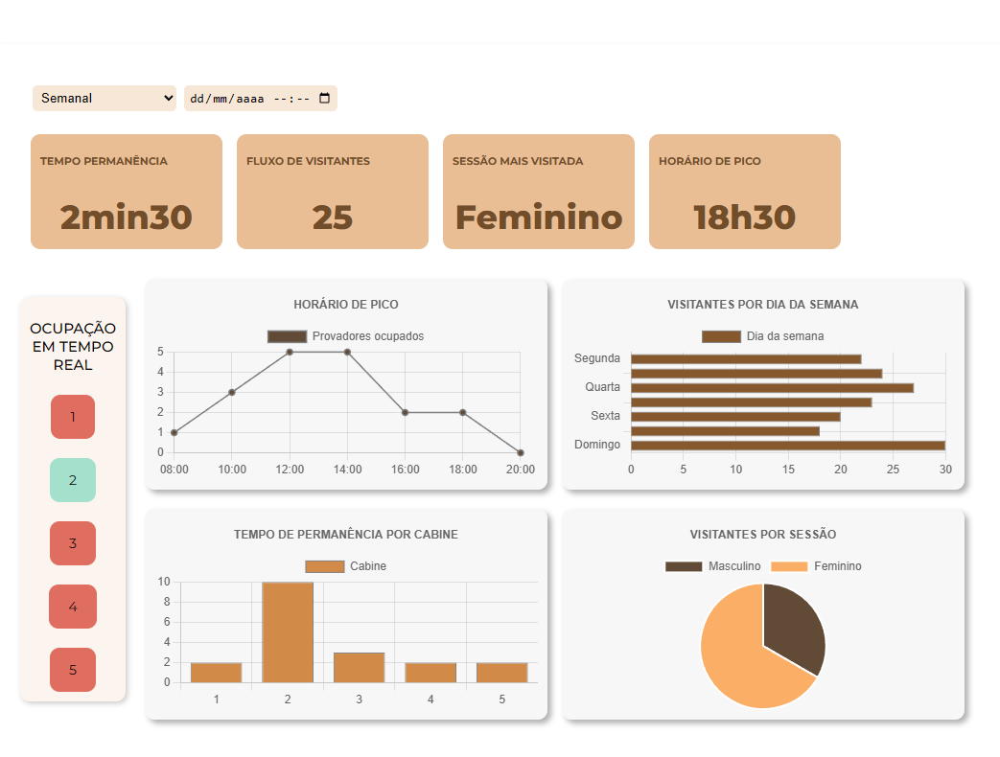

# FitAlert - Dashboard de Monitoramento de Fluxo

## 📦 Funcionalidades

- Visualização de dados em tempo real sobre a ocupação de provadores.
- Gráficos que mostram os horários de pico, tempo de permanência por cabine e visitantes por sessão.
- Filtros para visualização de dados diários, semanais, mensais e anuais.

## 🛠 Tecnologias Utilizadas

- [Chart.js](https://www.chartjs.org/) para criação de gráficos.
- HTML5 para estrutura da página.
- CSS para estilização (arquivo `style.css`).

